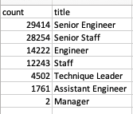
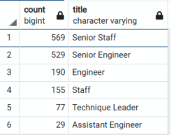

# Pewlett-Hackard-Analysis
## Overview of Analysis
### Purpose
* The purpose of this project was to complete an analysis on the employees for the company Pewlett-Hackard.  
* This company is anticipating many employees retiring in the coming years, so they wanted to know a couple of things:
  * The number of employees retiring by title
  * The number of employees who are eligible to participate in a mentorship program where they can mentor the next generation of employees
## Results
### Findings
* There were four major findings that came from this analysis:
  * There are 90,398 employees that are at retirement age
  * Of the 90,000 people eligible for retirement, only 2 have jobs at the Manager Level
  * The majority of people retiring (57,668 or 64%) have jobs at the Senior Level
  * There are 1,549 people at the company who are eligible to participate in the Mentorship Program.
 Below is an image of the table I created showing number of employees who are retiring by job title:
  
 
 
 ## Summary
 * In summary, my analysis found that the company will have 90,398 roles to fill due to people approaching retirement age
 ### Recommendations
 * I don't believe that the company has enough qualified mentors.  My findings found that there are only 1,549 mentors while there are over 90,000 jobs coming available.
 * I would recommend for the company to dive further into the mentorship eligible employees to see what jobs they have
 * I created a new table that similar to the one above it shows the titles of mentorship eligible employees:
  
 * This shows that the mentor employees have a similar distribution of jobs that need to be filled. However there are no mentors at the manager level.
 * The next step I would take would be to look at which departments both the retirees and mentors work in.
 * I created tables for both of these shown below:
 * 
 
